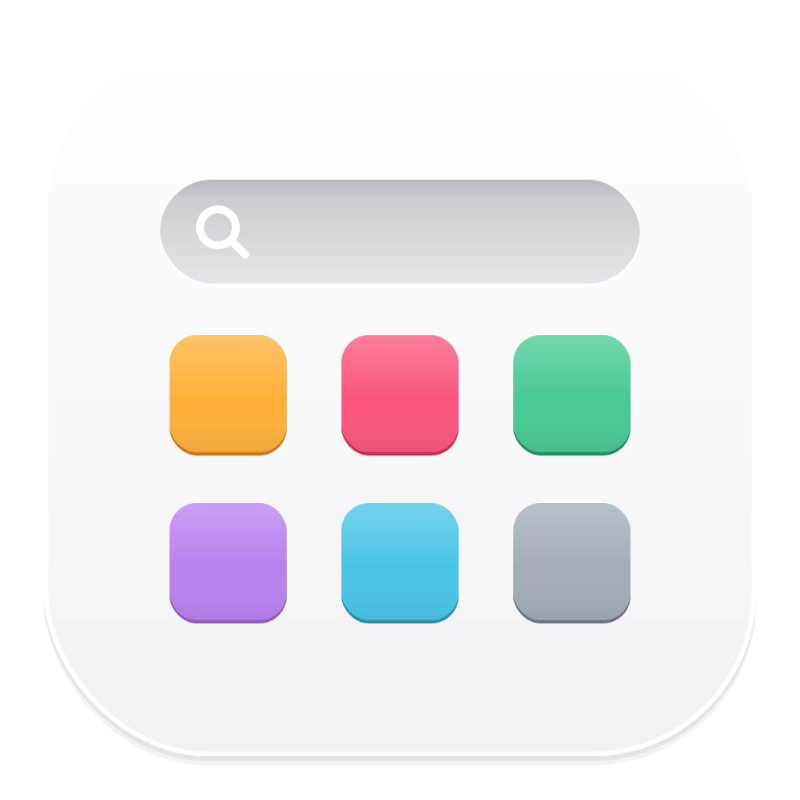
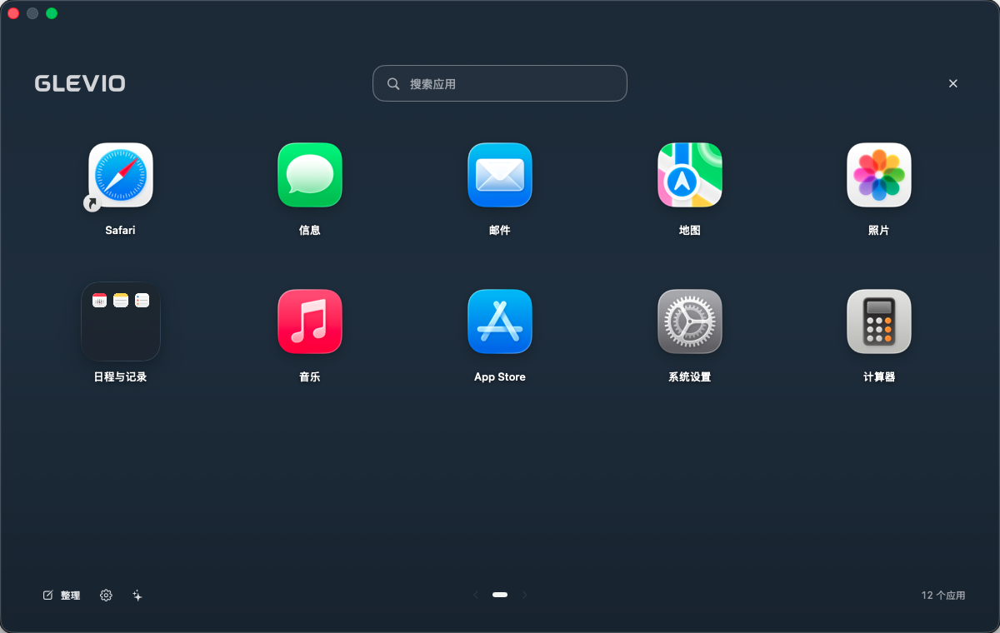

  
    
  <picture>
    <source media="(prefers-color-scheme: dark)" srcset="assets/wordmark-light.svg" />
    
  </picture>
  
<b>把应用，放回顺手的地方。</b>

  
适用于 macOS 26 的原生应用启动器

  

    
    
    
  

  
<b><a href="https://github.com/Lincb522/GLEVIO/releases/latest/download/GLEVIO.dmg">下载 macOS 版</a></b> &nbsp; · &nbsp; <a href="https://github.com/Lincb522/GLEVIO/releases">版本记录</a> &nbsp; · &nbsp; <a href="https://github.com/Lincb522/GLEVIO/issues">反馈问题</a>

   
  

> **当前下载：0.4.2 · build 16** · [查看发行说明](https://github.com/Lincb522/GLEVIO/releases/tag/v0.4.2)

## 熟悉的应用网格

全屏浏览应用，直接输入名称、拼音或首字母搜索。鼠标滚轮、触控板横滑和拖动空白区域都能翻页，方向键与 Return 也能完成启动。

| 整理应用 | 调整外观 |
| :--- | :--- |
| 系统应用自动归类，支持拖动建立文件夹 | 文件夹可选毛玻璃或原生液态玻璃 |
| 按名称排序、文件夹优先、自定义列数与图标大小 | 使用系统壁纸、自选图片或纯色背景 |
| 智能整理先预览，可选择类别并撤销 | 图片背景可调模糊与暗度，设置自动保存 |
| 将真实应用拖到 Dock，保留快捷入口 | 支持系统减少动态效果与减少透明度设置 |

## 0.4.2 · 主界面直接排序

点击主界面底部的 **排序**，无需进入设置即可切换排列方式。选择会同步保存，文件夹内部和搜索结果也使用同一排序。

| 排列方式 | 可选顺序 |
| :--- | :--- |
| 最近使用 | 最新优先 / 最早优先 |
| 安装时间 | 最新优先 / 最早优先 |
| 应用名称 | A–Z / Z–A |
| 手动排列 | 拖动调整 |

菜单同时提供「常用应用优先」和「文件夹优先」。选择新的自动排序会关闭常用优先，需要时可重新开启。

最近使用取 GLEVIO 记录的应用激活时间，下次打开时更新顺序；安装时间按应用加入当前目录的日期估算，移动或更新可能改变。没有记录的应用排在最后。

## 窗口与应用管理

支持窗口尺寸、拖入添加、常用应用优先，以及 Dock、启动和拖动交互。

| 改进 | 使用方式与变化 |
| :--- | :--- |
| **可调整窗口** | 在「设置 → 通用 → 窗口」切换全屏或窗口，选择预设、自定义宽高，或拖动边框并保存尺寸 |
| **Dock 边缘响应** | 接近底部、左侧或右侧 Dock 时提前解除 GLEVIO 的强制隐藏；靠近图标和拖动应用时保持可访问 |
| **拖入添加应用** | 将 `.app` 拖入窗口或 Dock 中的 GLEVIO 图标，选择安装到「应用程序」或复制到 GLEVIO 专属应用库 |
| **常用应用优先** | 首页最多显示 6 个常用入口，保留文件夹归属；顺序在下次打开时更新，可随时关闭 |
| **点击与拖动反馈** | 点击有按压动画，拖起后原位置留空；文件夹预览显示原本材质及内部应用图标 |
| **应用启动交接** | 打开应用前先收起 GLEVIO，失败时恢复界面并显示原因 |
| **设置重新分组** | 通用、排列、外观、智能整理、应用管理五页；按窗口宽度调整导航 |
| **agent 模型选择** | 分别配置 Codex / Claude 模型及处理强度，先用本机规则处理明确类别，再请求 agent |
| **整理预览** | 展开完整应用清单，区分新建文件夹与加入已有类别文件夹，相同请求短时复用建议 |
| **卸载权限处理** | 先移走应用本体，再处理关联数据；失败项目可重试，权限不足时提供系统「App 管理」入口 |

拖入添加时，两种位置都会**复制应用并保留原文件**，同名目标不会被覆盖。选择 GLEVIO 专属应用库后，移走原文件或推出 DMG 仍可打开；DMG 需先打开再拖入里面的 `.app`，PKG 使用系统安装器。

Dock 改进不修改系统全局偏好设置，系统自身的自动隐藏策略与动画仍然生效。

## 让本地 agent 帮助分类

支持 **Codex CLI** 和 **Claude Code**。在设置中选择已安装并登录的 CLI，再从「智能整理」生成分类建议，确认后应用。

在「设置 → 智能整理」中分别选择模型与处理强度，模型留空时沿用 CLI 配置。明确类别先由本机规则处理，agent 接收待识别应用的名称、标识和已知类别数量；CLI 可能连接云端服务，并不代表完全离线。

分类先预览、确认后应用，可加入同名且唯一的类别文件夹，其他文件夹和隐藏应用保持原状。生成过程可停止，未得到有效建议时仍可使用内置规则整理。

## 卸载时，一起查看关联文件

右键应用选择「卸载应用…」，或选中后按 `⌘ Delete`，查看应用本体、支持数据、缓存、偏好设置与其他可识别关联文件。确认后先将应用本体移到废纸篓，成功后再处理勾选的关联数据；失败项目可重试。

按名称匹配的数据默认不勾选。系统应用受保护，运行中的应用需先退出；共享容器与后台组件会显示并保留，钥匙串、驱动和任意自定义目录不在自动清理范围内。

## 安装与使用

1. [下载安装包](https://github.com/Lincb522/GLEVIO/releases/latest/download/GLEVIO.dmg)，打开 DMG，将 **GLEVIO** 拖入「应用程序」。也可使用 [ZIP 版本](https://github.com/Lincb522/GLEVIO/releases/latest/download/GLEVIO.zip)。
2. 打开 GLEVIO，通过 Dock、菜单栏或 **⌥ ⌘ Space** 显示与隐藏。
3. 在设置中选择文件夹材质、背景与排列方式；「检查更新」会读取这里发布的最新版本，提供下载入口。

| 操作 | 快捷方式 |
| :--- | :--- |
| 显示 / 隐藏 | `⌥ ⌘ Space` |
| 搜索应用 | 直接输入，支持拼音 |
| 选择并打开 | 方向键 → `Return` |
| 返回上一级 | `Esc` |
| 翻页 | 滚轮 / 触控板横滑 / 拖动空白处 |
| 卸载所选应用 | `⌘ Delete` |

> 当前版本使用本地签名，尚未完成 Apple 公证。首次打开可能需要在「系统设置 → 隐私与安全」中确认允许，参见 [Apple 的打开说明](https://support.apple.com/zh-cn/102445)。当前 Release 同时提供 [SHA-256 校验文件](https://github.com/Lincb522/GLEVIO/releases/latest/download/SHA256SUMS.txt)。

当前包已完成通用构建与包校验；排序菜单的实际交互、窄宽窗口表现，以及拖入安装与 Dock 首次触边仍待验证，详见 [发行说明](https://github.com/Lincb522/GLEVIO/releases/tag/v0.4.2)。

---

**开发者：ZIJIU522**

此仓库仅用于产品说明、问题反馈、版本清单和安装包发布。应用源代码保存在私有仓库，不在此处公开。
